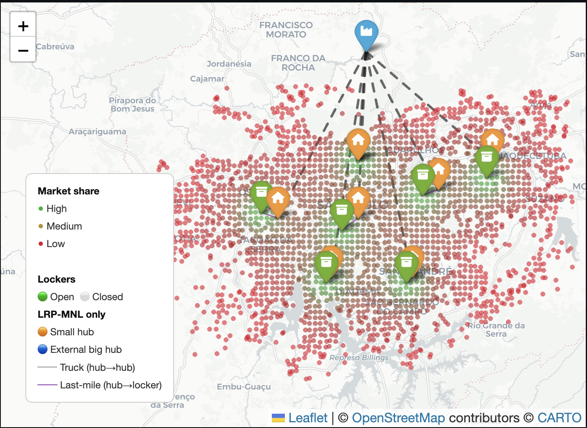
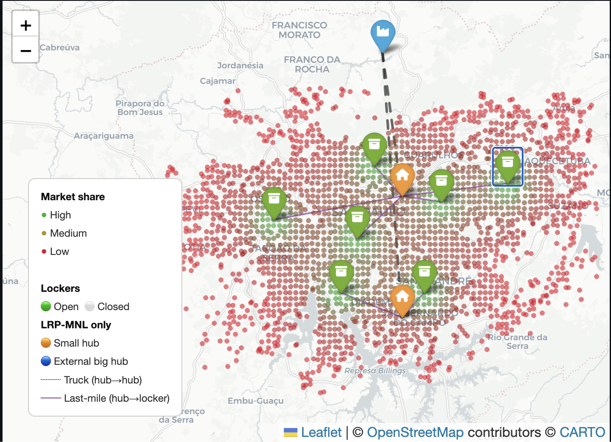

# Location Routing

## 1. Bilevel program

$$
\text{min: }
\sum_{k} \int{_k} y_k + \sum_{k} \phi (Z_{ik})
+ \sum_{k} \psi(x_k)

$$
$$\text{s.t.}
$$
$$
\text{max: market share}
$$

=> Assignment variables instead of routing constraints

---

$$
\sum_{k} \phi (Z_{ik}) \rarr \text{routing approximation costs}
$$

$$
\sum_{k} \psi(x_k) \rarr \text{crew size cost}
$$

---

## Routing costs + capacity and fleet size

$$
\text{UL, }
\qquad
\text{min: }
\sum_{j} f{_j} y_j + \sum_{j} a_j q_j + \sum_{i}\sum_{j} c_{ij}x_{ij}\omega_{ij}
+\sum_{i}\frac{\omega_i}{\sum_{j}u_{ij}y_{j}+1}
$$

$$
\sum_{i} \omega_{i} x_{ij} \le Qq_j \qquad \forall j
$$

$$
x_{ij} \le y_j \qquad \forall i,j
$$

$$
q_j \le My_j \qquad \forall j
$$

$$
\text{LL, }
\qquad
\text{max: }
\sum_{i} \omega_i \frac{\sum_{j}u_{ij}y_{j}}{\sum_{j}u_{ij}y_{j}+1}
$$

$$
x_{ij} = \frac{u_{ij}y_{j}}{\sum_{j}u_{ij}y_{j}+1}
$$

$$
c_{ij} \approxeq l_{ij} \sqrt{A_j.\eta_i } \rarr \text{Approximation of routing cost}
$$

## Variables and parameters

### Indices

| Symbol | Meaning |
|---|---|
| $i \in I$ | Demand zone (geographic grid cell) |
| $j \in J$ | Candidate site for a locker |

### Decision variables

| Symbol | Type | Meaning |
|---|---|---|
| $y_j \in \{0,1\}$ | Binary | 1 if locker $j$ is open, 0 otherwise |
| $q_j \in \mathbb{Z}_+$ | Integer | fleet size vehicules $j$ |
| $x_{ij} \geq 0$ | Continuous $[0,1]$ | Share of demand from zone $i$ captured by locker $j$, determined by the MNL (lower level) |

### Cost parameters

| Symbol | Meaning | Source / Value |
|---|---|---|
| $f_j \geq 0$ | Fixed opening cost of locker $j$ (rental, infrastructure) | **⚠ to be calibrated** — uniform across all sites or site-specific? |
| $a_j \geq 0$ | Cost per delivery staff member assigned to locker $j$ (daily wage, etc.) |  **⚠ to be calibrated** — corresponds to $\rho$ in Stokkink (cost per km traveled by a courier) |
| $Q$ | Courier capacity: number of parcels that can be delivered per shift |  **⚠ to be calibrated** — $q^{shift}$ in Stokkink (12 parcels/tour × 4 tours = 48) |
| $M$ | Big-M: upper bound on $q_j$ (e.g. $\lceil \sum_i \omega_i / Q \rceil$) | Computed automatically |

### Demand and utility parameters

| Symbol | Meaning | Source |
|---|---|---|
| $\omega_i > 0$ | Total demand of zone $i$ (number of parcels / customers) | `zone_demand.csv`, column `demand` |
| $u_{ij} = A_j / d_{ij}^\alpha$ | Utility of locker $j$ for zone $i$ (Huff gravity model) | `utility_matrix.csv`, column `u_ij` |

### Routing cost — BHH continuum approximation (Beardwood-Halton-Hammersley)

Source: **Stokkink & Geroliminis (2025)**, Section 4.3

$$
c_{ij} \approxeq l_{ij} \cdot \sqrt{A_j \cdot \eta_i}
$$

| Symbol | Meaning | Source |
|---|---|---|
| $c_{ij}$ | Total delivery cost from locker $j$ to zone $i$ per unit of demand | Computed |
| $l_{ij}$ | Distance (km) between the centroid of zone $i$ and locker $j$ — inter-zone (line-haul) component | `df_dist_dcs.csv`, column `Distance` |
| $A_j$ |  **⚠ AMBIGUOUS** — either the **area of the Voronoi cell of locker $j$** [km²] (BHH interpretation from Stokkink), or the **intrinsic attractiveness** $A_j$ of the Huff model (same letter in the paper's `.tex` file) | **Its the area** |
| $\eta_i$ | Delivery density in zone $i$: $\eta_i = \omega_i / \text{area}_i$ [parcels/km²] — in Stokkink, $n_j$ = number of stops in zone $j$ | Computable from `df_grids.csv` |

> **BHH interpretation (Stokkink eq. 15–17):** the total intra-zone tour length to serve $n_j$ customers in a zone of area $A_j$ is $L_j = k\sqrt{A_j \cdot n_j}$, with $k \approx 0.57$ (empirical constant). The line-haul component (round trip between locker $i$ and zone $j$) is $h_{ij} = 2\,t_{ij}\,m_j$, where $t_{ij}$ is the centroid-to-centroid distance and $m_j$ the number of tours. Total cost: $c_{ij} = \rho\,(h_{ij} + L_j)$ with $\rho$ = cost per km.

### Uncaptured demand term

$$
\sum_{i}\frac{\omega_i}{\sum_{j}u_{ij}y_{j}+1} = \sum_i \omega_i \cdot Z_i
$$

> Represents the demand that **does not use any locker** (goes to competitors or home delivery). In the UL **minimisation** objective, this term penalises the failure to capture demand. **⚠ Should there be a unit cost multiplier?** (e.g. cost of home delivery per parcel) → **yes : we multiply by $L$ = 20 BRL, the cost of one uncaptured parcel** (see Step 1). The term becomes $L\sum_i \omega_i Z_i$.

> **Note** (original line 79): the description "Market share of i captured by j" is incorrect — this term actually represents the share of demand from zone $i$ that is **not captured** by any locker ($= 1 - \text{captured share}$).

---

## ⚠ Questions

1. **$\omega_{ij}$ in the UL objective** (term $c_{ij} x_{ij} \omega_{ij}$): typo for $\omega_i$? The subscript $j$ is not defined anywhere in the variable list.

2. **$A_j$ in $c_{ij} \approx l_{ij}\sqrt{A_j \eta_i}$**: Voronoi cell area of locker $j$, or Huff model attractiveness? Both use the same letter in different parts of the formulation. -> Its the area

3. **Last term** $\sum_i \frac{\omega_i}{\sum_j u_{ij}y_j + 1}$: should it be multiplied by a unit cost (e.g. home delivery cost per parcel)? Or is it just the uncaptured share with no additional cost? -> multiplied by $L$ = 20 BRL (cost of one uncaptured parcel)

4. **$f_j$**: uniform fixed cost for all sites, or real per-site data? -> uniform

5. **$a_j$ and $Q$**: what do these correspond to exactly in the field data? (cost per courier per day? capacity in number of parcels per shift?) -> yes

---

## New considerations

- [x] split into other grid with bigger squares -> each cell represent a potential candidate for a small hub. 
  - Current grid represent the demand for each zone
  - new grid zone, with bigger cells (called G2) -> lockers
  - other grid wither bigger cells than G2, (called G3) -> small hubs

- [x] Consider big Hubs accross the country, we know (fixed) the capacity of the flow from the hub to the whole big grid 

- [x] small Hubs have to be placed during the resolution -> **Actually, its precomputed before the MNL (iterate throught each small hub withing 15km range)**

- [x] Routing 
  - truck goes from hubs to small hubs 
  - then bicycle, cars, ... goes from small hubs to deliver to lockers

## Results

As we can see 
first of all, we had an issue, we counted twice the routing cost, so basically the distance between lockers and hub is super small. 

After that fixed we had this : 

We can see that lockers cover more demande (around 17% of total demand) but we can see that they are still a bit clustered.

### Step 1

### Brief
- [x] add costs of lost market share
- [x] no capacity for lockers
- [x] fix the capture radius (too restricted vs the MILP)
- [x] one hub should cover several lockers (real 2nd echelon)

We have to add a cost of lossing a market share so it gives it more weight and less for the routing price so we couldn't see anymore clusters of lockers

$$
\text{UL, }
\qquad
\text{min: }
\sum_{j} f{_j} y_j + \sum_{j} a_j q_j + \sum_{i}\sum_{j} c_{ij}x_{ij}\omega_{ij}
+\sum_{i}\frac{\omega_i}{\sum_{j}u_{ij}y_{j}+1}.L
$$

where $L$ = **20 BRL** is the **cost of one uncaptured parcel** — the money lost when a parcel
goes to a competitor instead of a locker. It plays two roles at once : it prices the lost
demand (so the term is in BRL, comparable to the other costs) **and** it gives the model the
incentive to capture market share. There is a single parameter for this : `L`.

With L the lockers do spread on the demand (market share goes from ~19% to ~22% at P=7).
But L saturates very fast : L=2, 5 and 10 give exactly the **same** solution, so above
L≈2 it's the number of lockers P that limits, not the weight.

**Capture radius.** If we compare with the exact MILP, the MILP captures almost every zone
(~79%) because its outside option is tiny, while our MNL was way too restricted (~22%). So
we widened the locker attractiveness (`A_HUFF` 5 → 12) to get a coherent middle, and we
lowered the routing price (`COST_PER_KM` 0.7 → 0.3) so it stays a small secondary cost. Now
the lockers are more or less at the same place as the MILP but we capture ~36% of the demand.

**Too many hubs:** 

With the hubs free the solver opened **one hub per locker** (7 hubs).
Be careful — the hubs are **not** free : each open hub costs `F_HUB` + the amortised
`OPEN_HUB` ≈ 2 205 BRL/day, so 7 hubs already cost 15 435/day. The real culprit was the
**link** hub→locker :

- a locker could only be served by the hub of its **own** G3 cell — the old constraint
  $y_j \le v_{h(j)}$, a fixed geographic nesting where $h(j)$ is the G3 cell that contains
  locker $j$ — and
- that link had **no distance cost**.

So to keep the 7 lockers on their best capture spots (which happen to fall in 7 different G3
cells) the solver was *forced* to open the 7 matching hubs : it had no way to share one hub
between two lockers.

So we added the real **second echelon** : a locker can now be served by **any** open hub
(within a reach `MAX_DIST_HUB_KM`), and the van/bike tour from the hub to the locker is
**priced**.

**How the hubs and distances are set up.** The hub candidates are the **G3 cells** (~25 km²),
each with a fixed centroid; the lockers are **G2 cells**, also with a fixed centroid. *Before*
the optimisation we precompute, for every (hub, locker) pair within `MAX_DIST_HUB_KM`, the
distance $l_{hj}$ = the Euclidean distance (km) between the hub centroid and the locker
centroid. So the positions and distances are **fixed data** — the solver only *chooses* which
hubs to open ($v_h$) and who serves whom ($a_{hj}$).

| Symbol | Type | Meaning |
|---|---|---|
| $h$ | index | a candidate small hub (a G3 cell) |
| $j$ | index | a candidate locker (a G2 cell) |
| $v_h$ | binary $\{0,1\}$ | = 1 if hub $h$ is open |
| $y_j$ | binary $\{0,1\}$ | = 1 if locker $j$ is open |
| $a_{hj}$ | continuous $[0,1]$ | share of locker $j$ supplied by hub $h$ (the assignment) — in practice 0 or 1 : "locker $j$ is served by hub $h$" |
| $l_{hj}$ | constant (km) | distance between hub $h$ and locker $j$ (precomputed) |
| $\rho_2$ | constant (BRL/km/day) | van/bike tour cost per km per day (`COST_PER_KM_HUB` = 100). The knob. |

Objective term (added) and constraints :

$$
\dots + \sum_{h}\sum_{j} \rho_2 \, l_{hj} \, a_{hj}
\qquad
\sum_{h} a_{hj} = y_j , \quad a_{hj} \le v_h
$$

- the new term = total daily cost of the hub→locker tours ; only used pairs ($a_{hj}=1$) are paid.
- $\sum_h a_{hj} = y_j$ : an open locker is served by **exactly one** hub (a closed locker by none).
- $a_{hj} \le v_h$ : a locker can only be served by an **open** hub.
- $a_{hj}$ is kept **continuous** (not binary) so it doesn't add integer variables ; minimising the transport pushes it to 0/1 anyway (the nearest open hub).

Now, one hub covers several lockers, and the solver arbitrates **"open a hub (~2 205/day)"**
vs **"deliver from an existing hub ($\rho_2 \cdot l_{hj}$/day)"**. Concretely at $\rho_2=100$,
the 2-hub solution costs $2\times2\,205 + 7\,859$ tours $= $ **12 269/day**, cheaper than the
7-hub one (**15 435/day**) **for the same capture** — so it consolidates to **2 hubs** (one
serves 5 lockers, one serves 2 ; tours 5–21 km). $\rho_2$ is the knob : smaller → fewer hubs /
longer tours, bigger → more hubs / shorter tours. (one trick : Gurobi keeps the hub count of
its warm-start, so we feed it a greedy warm-start that already opens the right number of hubs
for the chosen $\rho_2$.)

### Constants used (default values)

| Constant (code) | Symbol | Value | Meaning |
|---|---|---|---|
| `F_LOCKER` | $f_j$ | **150 BRL/day** | locker daily OpEx (rent + electricity + maintenance) |
| `OPEN_LOCKER` | $o_j$ | **20 000 BRL** | locker one-time opening CapEx (unit + install) |
| `F_HUB` | $F_h$ | **2 000 BRL/day** | small-hub daily OpEx |
| `OPEN_HUB` | $O_h$ | **150 000 BRL** | small-hub one-time opening CapEx (fit-out) |
| `AMORT_DAYS` | $T$ | **730 days** | CapEx amortisation horizon (≈2 yr) → daily charge = CapEx / $T$ |
| `A_VEHICLE` | $a_j$ | **200 BRL/day** | cost per delivery vehicle (last-mile courier) |
| `Q_CAPACITY` | $Q$ | **80 parcels/day** | throughput per vehicle |
| `COST_PER_KM` | $\rho$ | **0.30 BRL/km** | last-mile (locker→zones) BHH routing cost |
| `COST_PER_KM_HUB` | $\rho_2$ | **100 BRL/km/day** | hub→locker van-tour cost (2nd echelon) |
| `MAX_DIST_HUB_KM` | — | **30 km** | maximum hub→locker reach |
| `L` | $L$ | **20 BRL/parcel** | cost of one uncaptured parcel (prices lost demand + drives capture) |
| `A_HUFF` | $A$ | **12** | locker attractiveness (MNL) ; bigger → wider capture radius |
| `ALPHA` | $\alpha$ | **2** | Huff distance-decay exponent |
| `BIG_HUB_FLUX_FACTOR` | — | **1.5** | big-hub flux = 1.5 × total demand (so it never binds) |
| `G2_FACTOR` / `G3_FACTOR` | — | **3 / 5** | grid merge (locker cell ~9 km², hub cell ~25 km²) |

Daily-equivalent CapEx : locker $20\,000/730 \approx$ **27 BRL/day**, hub $150\,000/730 \approx$
**205 BRL/day**. So an open locker ≈ **177 BRL/day** total, an open hub ≈ **2 205 BRL/day**.
*(`P_HUB` is left free = `P`, the hub count is cost-driven ; the per-hub flow cap `CAP_HUB`
is no longer enforced in the flexible model — it would be bilinear — only the big-hub flux caps total throughput.)*

### Step 2

add capacity
test for 30% of total demand,
next 40% , ...

### Step 3

add congestion

$$
\phi(f)=
\frac {cf}{\tau-f}
$$
$$
c \rarr \text{prox cost (very small)}
$$
$$
f \rarr \text{flow}
$$
$$
\tau \rarr \text{capacity}
$$

clients complain when congestion is btw 70% to 80%

*Reference document — UFMG Internship 2026 — Bastien Jacquelin*
