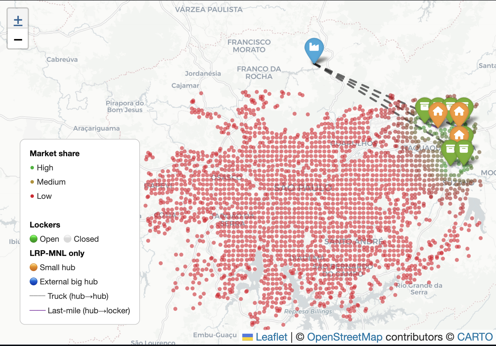
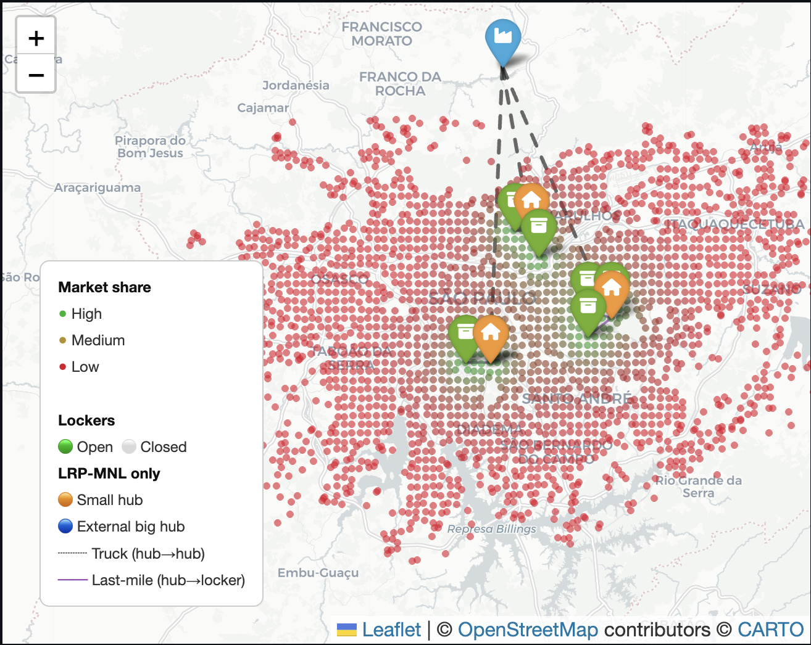

# Location Routing

## 1. Bilevel program

$$
\text{min: }
\sum_{k} \int{_k} y_k + \sum_{k} \phi (Z_{ik})
+ \sum_{k} \psi(x_k)

$$
$$\text{s.t.}
$$
$$
\text{max: market share}
$$

=> Assignment variables instead of routing constraints

---

$$
\sum_{k} \phi (Z_{ik}) \rarr \text{routing approximation costs}
$$

$$
\sum_{k} \psi(x_k) \rarr \text{crew size cost}
$$

---

## Routing costs + capacity and fleet size

$$
\text{UL, }
\qquad
\text{min: }
\sum_{j} f{_j} y_j + \sum_{j} a_j q_j + \sum_{i}\sum_{j} c_{ij}x_{ij}\omega_{ij}
+\sum_{i}\frac{\omega_i}{\sum_{j}u_{ij}y_{j}+1}
$$

$$
\sum_{i} \omega_{i} x_{ij} \le Qq_j \qquad \forall j
$$

$$
x_{ij} \le y_j \qquad \forall i,j
$$

$$
q_j \le My_j \qquad \forall j
$$

$$
\text{LL, }
\qquad
\text{max: }
\sum_{i} \omega_i \frac{\sum_{j}u_{ij}y_{j}}{\sum_{j}u_{ij}y_{j}+1}
$$

$$
x_{ij} = \frac{u_{ij}y_{j}}{\sum_{j}u_{ij}y_{j}+1}
$$

$$
c_{ij} \approxeq l_{ij} \sqrt{A_j.\eta_i } \rarr \text{Approximation of routing cost}
$$

## Variables and parameters

### Indices

| Symbol | Meaning |
|---|---|
| $i \in I$ | Demand zone (geographic grid cell) |
| $j \in J$ | Candidate site for a locker |

### Decision variables

| Symbol | Type | Meaning |
|---|---|---|
| $y_j \in \{0,1\}$ | Binary | 1 if locker $j$ is open, 0 otherwise |
| $q_j \in \mathbb{Z}_+$ | Integer | fleet size vehicules $j$ |
| $x_{ij} \geq 0$ | Continuous $[0,1]$ | Share of demand from zone $i$ captured by locker $j$, determined by the MNL (lower level) |

### Cost parameters

| Symbol | Meaning | Source / Value |
|---|---|---|
| $f_j \geq 0$ | Fixed opening cost of locker $j$ (rental, infrastructure) | **⚠ to be calibrated** — uniform across all sites or site-specific? |
| $a_j \geq 0$ | Cost per delivery staff member assigned to locker $j$ (daily wage, etc.) |  **⚠ to be calibrated** — corresponds to $\rho$ in Stokkink (cost per km traveled by a courier) |
| $Q$ | Courier capacity: number of parcels that can be delivered per shift |  **⚠ to be calibrated** — $q^{shift}$ in Stokkink (12 parcels/tour × 4 tours = 48) |
| $M$ | Big-M: upper bound on $q_j$ (e.g. $\lceil \sum_i \omega_i / Q \rceil$) | Computed automatically |

### Demand and utility parameters

| Symbol | Meaning | Source |
|---|---|---|
| $\omega_i > 0$ | Total demand of zone $i$ (number of parcels / customers) | `zone_demand.csv`, column `demand` |
| $u_{ij} = A_j / d_{ij}^\alpha$ | Utility of locker $j$ for zone $i$ (Huff gravity model) | `utility_matrix.csv`, column `u_ij` |

### Routing cost — BHH continuum approximation (Beardwood-Halton-Hammersley)

Source: **Stokkink & Geroliminis (2025)**, Section 4.3

$$
c_{ij} \approxeq l_{ij} \cdot \sqrt{A_j \cdot \eta_i}
$$

| Symbol | Meaning | Source |
|---|---|---|
| $c_{ij}$ | Total delivery cost from locker $j$ to zone $i$ per unit of demand | Computed |
| $l_{ij}$ | Distance (km) between the centroid of zone $i$ and locker $j$ — inter-zone (line-haul) component | `df_dist_dcs.csv`, column `Distance` |
| $A_j$ |  **⚠ AMBIGUOUS** — either the **area of the Voronoi cell of locker $j$** [km²] (BHH interpretation from Stokkink), or the **intrinsic attractiveness** $A_j$ of the Huff model (same letter in the paper's `.tex` file) | **Its the area** |
| $\eta_i$ | Delivery density in zone $i$: $\eta_i = \omega_i / \text{area}_i$ [parcels/km²] — in Stokkink, $n_j$ = number of stops in zone $j$ | Computable from `df_grids.csv` |

> **BHH interpretation (Stokkink eq. 15–17):** the total intra-zone tour length to serve $n_j$ customers in a zone of area $A_j$ is $L_j = k\sqrt{A_j \cdot n_j}$, with $k \approx 0.57$ (empirical constant). The line-haul component (round trip between locker $i$ and zone $j$) is $h_{ij} = 2\,t_{ij}\,m_j$, where $t_{ij}$ is the centroid-to-centroid distance and $m_j$ the number of tours. Total cost: $c_{ij} = \rho\,(h_{ij} + L_j)$ with $\rho$ = cost per km.

### Uncaptured demand term

$$
\sum_{i}\frac{\omega_i}{\sum_{j}u_{ij}y_{j}+1} = \sum_i \omega_i \cdot Z_i
$$

> Represents the demand that **does not use any locker** (goes to competitors or home delivery). In the UL **minimisation** objective, this term penalises the failure to capture demand. **⚠ Should there be a unit cost multiplier?** (e.g. cost of home delivery per parcel)

> **Note** (original line 79): the description "Market share of i captured by j" is incorrect — this term actually represents the share of demand from zone $i$ that is **not captured** by any locker ($= 1 - \text{captured share}$).

---

## ⚠ Questions

1. **$\omega_{ij}$ in the UL objective** (term $c_{ij} x_{ij} \omega_{ij}$): typo for $\omega_i$? The subscript $j$ is not defined anywhere in the variable list.

2. **$A_j$ in $c_{ij} \approx l_{ij}\sqrt{A_j \eta_i}$**: Voronoi cell area of locker $j$, or Huff model attractiveness? Both use the same letter in different parts of the formulation. -> Its the area

3. **Last term** $\sum_i \frac{\omega_i}{\sum_j u_{ij}y_j + 1}$: should it be multiplied by a unit cost (e.g. home delivery cost per parcel)? Or is it just the uncaptured share with no additional cost?

4. **$f_j$**: uniform fixed cost for all sites, or real per-site data? -> uniform

5. **$a_j$ and $Q$**: what do these correspond to exactly in the field data? (cost per courier per day? capacity in number of parcels per shift?) -> yes

---

## New considerations

- [ ] split into toher grid with bigger squares -> each cell represent a potential candidate for a small hub. 
  - Current grid represent the demand for each zone
  - new grid zone, with bigger cells (called G2) -> lockers
  - other grid wither bigger cells than G2, (called G3) -> small hubs

- [ ] Consider big Hubs accross the country, we know (fixed) the capacity of the flow from the hub to the whole big grid 

- [ ] small Hubs have to be placed during the resolution

- [ ] Routing 
  - truck goes from hubs to small hubs 
  - then bicycle, cars, ... goes from small hubs to deliver to lockers

---

## Implementation decisions (6-4_location_routing.py)

### Cost structure — daily OpEx + one-time opening CapEx

Each opened site now carries **two** costs:

| Site | Daily OpEx (recurring) | Opening CapEx (one-time) |
|---|---|---|
| Locker | $f^{\text{op}}_j$ = `F_LOCKER` = 150 BRL/day | $o_j$ = `OPEN_LOCKER` = 20 000 BRL |
| Small hub | $F^{\text{op}}_h$ = `F_HUB` = 2 000 BRL/day | $O_h$ = `OPEN_HUB` = 150 000 BRL |

The objective is expressed **per day**, so the one-time CapEx is **amortised** over a
horizon $T$ = `AMORT_DAYS` (≈2 years = 730 days) and added as a daily-equivalent charge:

$$
\sum_{j}\Big(f^{\text{op}}_j + \tfrac{o_j}{T}\Big)y_j
\;+\;
\sum_{h}\Big(F^{\text{op}}_h + \tfrac{O_h}{T}\Big)v_h
$$

Opening a small hub is *largement supérieur* to a locker (≈13× the daily cost and
≈7.5× the CapEx). The full one-time CapEx of the chosen solution is reported separately.

### Routing cost — BHH double-count fix (lockers were clustering at the periphery)

The BHH approximation $c_{ij}=\rho\,l_{ij}\sqrt{A_j\,\eta_i}$ is **already a total tour
cost** for the zone, because $\sqrt{A_j\,\eta_i}\approx\sqrt{n_i}$ (number of parcels in
the cell). Multiplying it **again** by $\omega_i$ in the objective double-counts demand:
the penalty to serve a zone scales as $\omega_i^{1.5}$ while the capture reward
$\text{COST\_UNCAPTURED}\cdot\omega_i$ is only linear in $\omega_i$. Dense central zones
then look "too expensive", so the optimiser parked the lockers in low-density cells at the
city edge (observed: all lockers at the northern extremity, market share *dropping* as $P$
grew). **Fix:** weight the routing term by the captured share only,
$\sum_{ij} c_{ij}\,x_{ij}$ (no extra $\omega_i$ — flag `ROUTING_WEIGHT_BY_DEMAND=False`).

### Uncaptured-demand weight $L$ (step 1)

Even with the routing fixed, the $P$ lockers stay a bit clustered. To push them to
cover more distinct demand we add a weight $L$ on the uncaptured-demand term:

$$
\dots + L \cdot \text{COST\_UNCAPTURED} \cdot \sum_i \omega_i Z_i
$$

In code: `L` (env `MNL_L`, default `1`) multiplies the existing per-parcel penalty
`COST_UNCAPTURED` (= 20). Raising $L$ makes lost demand more important, so the optimiser
spreads the lockers to capture more zones instead of clustering. The dashboard exposes
this as the variant **"with cost on lost market share"** ($L=3$) next to the $L=1$ one.

### Single external big hub

Exactly **one** big hub, placed arbitrarily outside the demand bounding box (north,
centred E–W). Its inbound flux is fixed at $1.5\times$ total demand, so the big-hub
capacity constraint (BCAP) never binds — only the small hubs and lockers are optimised.
Small-hub throughput `CAP_HUB` = 3 000 parcels/day (coherent micro-depot).

---

## Results

As we can see 
first of all we had an issue, we counted twice the routing cost, so basically the distance between lockers and hub is super small. After that fixed we had this : 

We can see that lockers cover more demande (around 17% of total demand) but we can see that they are still a bit clustered.

### Step 1

### Brief
- [x] add costs of lost market share
- [x] no capacity for lockers

We have to add a cost of lossing a market share so it gives it more weight and less for the routing price so we couldn't see anymore clusters of lockers

$$
\text{UL, }
\qquad
\text{min: }
\sum_{j} f{_j} y_j + \sum_{j} a_j q_j + \sum_{i}\sum_{j} c_{ij}x_{ij}\omega_{ij}
+\sum_{i}\frac{\omega_i}{\sum_{j}u_{ij}y_{j}+1}.L
$$

given L is a weight to give more importance to the market share

### Step 2

add capacity
test for 30% of total demand,
next 40% , ...

### Step 3

add congestion

$$
\phi(f)=
\frac {cf}{\tau-f}
$$
$$
c \rarr \text{prox cost (very small)}
$$
$$
f \rarr \text{flow}
$$
$$
\tau \rarr \text{capacity}
$$

clients complain when congestion is btw 70% to 80%

---

## Approach & issues encountered (chronological)

The calibration was iterative; each step fixed a problem revealed by the previous map.
All variants are kept in the Streamlit dashboard as a trace.

1. **Routing cost double-counted by demand** → lockers clustered at the city edge
   (top-right), capturing almost nothing (market share ~1–4 %, and it even *dropped*
   as P grew). The BHH cost $c_{ij}=\rho\,l_{ij}\sqrt{A_j\eta_i}$ is already a total
   tour cost ($\sqrt{A_j\eta_i}\approx\sqrt{n_i}$); the objective multiplied it again
   by $\omega_i$, so serving a dense zone scaled as $\omega_i^{1.5}$ vs a capture
   reward only $\propto\omega_i$. **Fix:** weight routing by the captured share only
   (`ROUTING_WEIGHT_BY_DEMAND=False`). Market share became monotone in P (P=3 → 11 %,
   P=7 → 19 %). *(variant: "routing cost double-counts demand")*

2. **Opening cost added.** Each site now carries a one-time CapEx (locker 20 000 BRL,
   hub 150 000 BRL) on top of the daily OpEx, amortised over `AMORT_DAYS` = 730 days.

3. **Weight $L$ on uncaptured demand** (term $L\cdot C_0\cdot\sum_i\omega_i Z_i$) to push
   capture and break the remaining clustering. **Issue:** $L$ *saturates* — L = 2, 5, 10
   give the **identical** solution (22.7 %). Beyond L≈2 it is P (and the hubs) that bind,
   not the weight.

4. **Hub count freed** (`P_HUB = P`, cost-driven instead of a hard cap). **Issue:** the
   solver then opens **one hub per locker** (7 hubs), because spreading lockers captures
   more than a hub costs ⇒ the hub cost is currently **too low** to act as a real lever.

5. **Convergence to the "no routing" target verified.** With free hubs and L≥2 the full
   model gives *exactly* the same lockers/hubs as solving with `COST_PER_KM=0`
   (capture-maximisation). Routing had become non-binding. *(variant: "no routing — target")*

6. **Capture-radius mismatch (MILP vs LRP).** The Exact-MILP model captures ~71 % of
   *every* zone (overall 79 %, very wide radius) because its outside option is tiny; the
   LRP with $U_0=1$ (fixed by Charnes-Cooper) has a narrow radius (~22 %). **Fix:** raise
   the locker attractiveness `A_HUFF` 5 → 12 for a coherent middle, and re-introduce a
   **secondary, coherent routing cost** `COST_PER_KM` 0.70 → 0.30.
   *(variant: "balanced — coherent costs")*

### Current balanced result (P=7, A_HUFF=12, COST_PER_KM=0.30, L=1, free hubs)

Market share **36.5 %** (between MILP 79 % and the narrow LRP 22 %). Daily cost breakdown:

| Term | BRL/day | Share |
|---|---|---|
| Uncaptured-demand penalty | 135 200 | 80 % |
| Hubs (7) | 15 438 | 9 % |
| Fleet (51 vehicles) | 10 200 | 6 % |
| Routing | 6 682 | 4 % |
| Lockers (7) | 1 242 | 1 % |

Routing is now a **secondary term (4 %)**, on par with the fleet cost — coherent, since
last-mile delivery (fleet + routing ≈ 17 k) naturally exceeds the locker rental (1.2 k).

7. **Why so many hubs, and the real fix — a flexible 2nd echelon.** Raising the hub
   cost alone did *not* reduce the 7 hubs (even at 2 822 BRL/day/hub) and made the MILP
   intractable. The reason: the original model had **no hub→locker transport cost** and a
   **fixed** geographic nesting (each locker tied to the hub of its own G3 cell), so an
   extra hub was "free coverage". **Fix:** make the hub→locker link a *decision* —
   continuous assignment $a_{hj}\in[0,1]$ (any open hub may supply any locker within
   `MAX_DIST_HUB_KM`), with a tour cost $\rho_2\cdot\text{dist}(h,j)\cdot a_{hj}$ in the
   objective. The solver now trades **"open a hub" (≈2 205/day)** against **"deliver a
   locker from an existing hub" ($\rho_2\cdot$dist/day)**, so one hub can cover several
   lockers. *(variant: "2-echelon hub routing")*
   - **Solver note:** Gurobi keeps the **hub count of the warm start** within the time
     limit (it neither closes nor opens hubs from it). So the warm start must already use
     the right count: a **greedy facility-location warm start** opens a hub while it lowers
     (hub cost + transport), i.e. it adapts to $\rho_2$. With it, $\rho_2=40$ → **1 hub**,
     **$\rho_2=100$ → 2 hubs** (g6_8 serves 5 lockers, g2_8 serves 2; van tours 5–21 km,
     79 km/day, 7 859 BRL/day). $\rho_2$ is the compromise knob: low → few hubs / long
     tours, high → more hubs / short tours.

### Current balanced result (P=7, A_HUFF=12, COST_PER_KM=0.30, L=1, free hubs)

Market share **36.5 %** (between MILP 79 % and the narrow LRP 22 %). Daily cost breakdown:

| Term | BRL/day | Share |
|---|---|---|
| Uncaptured-demand penalty | 135 200 | 80 % |
| Hubs (7) | 15 438 | 9 % |
| Fleet (51 vehicles) | 10 200 | 6 % |
| Routing | 6 682 | 4 % |
| Lockers (7) | 1 242 | 1 % |

Routing is now a **secondary term (4 %)**, on par with the fleet cost — coherent, since
last-mile delivery (fleet + routing ≈ 17 k) naturally exceeds the locker rental (1.2 k).
The 2-echelon variant replaces the 7 hubs with **2** (default $\rho_2=100$, tunable).

### Final model (default configuration)

| Layer | Decision | Cost in objective |
|---|---|---|
| Big hub (1, external) | fixed | — (flux ≥ demand, non-binding) |
| Small hubs | open `v_h` (cost-driven count) | `F_HUB` + amortised `OPEN_HUB` per open hub |
| Hub → locker | flexible assignment `a_{hj}` | $\rho_2\cdot$dist tour cost (`COST_PER_KM_HUB`=100) |
| Lockers | open `y_j` (exactly P) | `F_LOCKER` + amortised `OPEN_LOCKER` |
| Locker → zones | MNL capture `x_{ij}` | BHH `COST_PER_KM`=0.30 + `L`·`COST_UNCAPTURED` penalty |

Defaults: `A_HUFF`=12 (coherent capture radius), `COST_PER_KM`=0.30, `L`=1,
`COST_PER_KM_HUB`=100, `MAX_DIST_HUB_KM`=30. Result at P=7: **2 hubs, 7 lockers,
36.5 % market share**.

### Dashboard variants kept (the story)

1. **routing double-count (clusters)** — the initial bug, lockers at the edge (3.9 %).
2. **coherent costs (7 hubs)** — radius + costs fixed (36.5 %) but one hub per locker.
3. **two-echelon hubs (final)** — flexible hub↔locker routing → 2 hubs, real tours.

(Intermediate experiments — L-weight sweep, no-routing target, single-echelon L=1 — were
removed from the dashboard; their CSVs stay on disk as a trace.)

### Open issues / next steps

- **$\rho_2$ tuning** chooses the hub count: 40 → 1 hub, **100 → 2 hubs** (default), higher
  → 3+. Pick per the realistic operating target.
- **MIP gap** stays high (~18 %, no-progress stop); the flexible assignment enlarges the
  LP — the warm start gives a good incumbent, but proving optimality needs more time or a
  tighter formulation. Hub *placement* could still improve within the gap.

*Reference document — UFMG Internship 2026 — Bastien Jacquelin*
